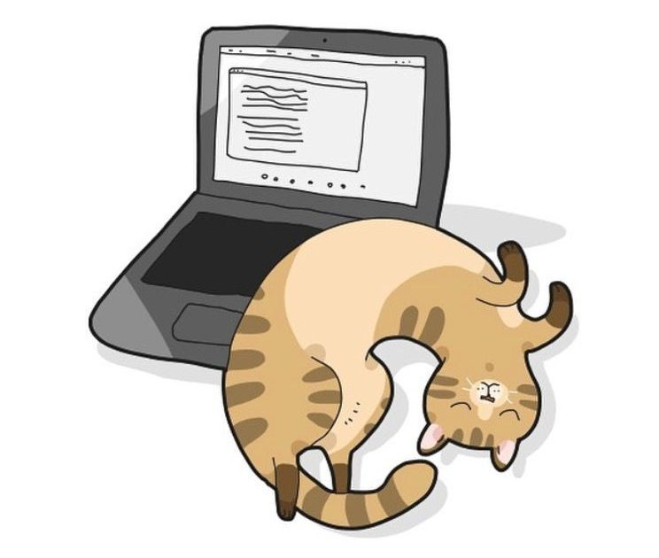
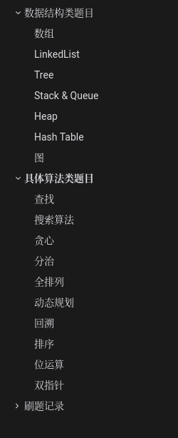

## LeetCode 归纳性刷题

> 用战术上的勤奋, 掩盖战略上的懒惰

</img>

| &nbsp;大厂TOP题 | &nbsp;LeetCode题型总结 | &nbsp;剑指offer | &nbsp;面试金典 |
| :-------------: | :--------------------: | :-------------: | :------------: |
|   :moneybag:    |        :crown:         |  :closed_book:  |  :blue_book:   |

### 大厂TOP题

展开

* [x] 字节跳动2020春招

### LeetCode题型总结

#### 数据结构

* [x] 链表
* [x] 二叉树
* [x] 位运算
* [x] 栈&队列
* [ ] 数组&矩阵
* [ ] 哈希
* [ ] 图
* [ ] 字符串

#### 算法

* [x] 回溯

* [x] 二分查找
* [ ] 动态规划
* [ ] 广度优先遍历
* [ ] 深度优先遍历

### 剑指offer

<a href="md/offer.md" target="_blank"></img></a>

### 程序员面试金典

**ToDo**

### 贡献者

### Contribute

这个仓库目前还在不断完善之中, 有些题型,大厂算法还没进行整理. 同时,如果你有很棒的想法, 欢迎提 issues 或者 pull requests！

**Contributers:** 

 

 

 

