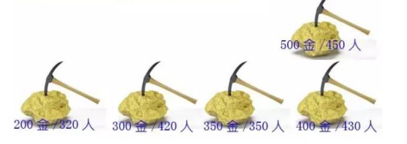

# 动态规划

​	**动态规划**(Dynamic Programming，DP)是运筹学的一个分支，将一类活动分为若干个互相联系的阶段，每一个阶段的决策常常影响到下一个阶段的决策，动态规划利用各阶段之间的关系进行逐个求解，最终地到全局最优化的过程，常用于背包问题、生产经营问题。资金管理问题、资源分配问题、最短路径和复杂系统可靠性等有重叠子问题和最优子结构性质的问题中。

### 动态规划套路解析

​	寻找三个重要概念：最优子结构、边界、状态转移公式

​	遵循的一般流程：递归的暴力解法->带备忘录的递归解法->非递归的动态规划解法

### 例题一：LeetCode：70.爬楼梯

假设你正在爬楼梯。需要 *n* 阶你才能到达楼顶。

每次你可以爬 1 或 2 个台阶。你有多少种不同的方法可以爬到楼顶呢？

**注意：**给定 *n* 是一个正整数。

 https://leetcode-cn.com/problems/climbing-stairs/description/?utm_source=LCUS&utm_medium=ip_redirect_q_uns&utm_campaign=transfer2china

##### 题目解析

​	假设只差最后一步就走到第10（假设n为10）阶台阶时有两种情况：

​	第一种是从9阶走到10 阶；

​	第二种是从8阶走到10阶。

​	如果我们已经知道从0到8阶的走法F(8)=X，从0到9阶的走法F(9)=Y。而10级台阶的走法可以根据最后一步的不同分为如上两种，则F(10)=X+Y=F(9)+F(8)，利用刚才的思路可以推断出F(9)=F(8)+F(7)，F(8)=F(7)+F(6)。并且边界是当只有1阶或者2阶台阶时的走法，显然F(1)=1，F(2)=2,由此我们可以归纳出如下公式：

​	F(1) = 1;

​	F(2) = 2;

​	F(n) = F(n-1)+F(n-2)（n>=3）

###### 方法一：递归求解

```java
public int climbStairs(int n){
	if(n<1)
		return 0;
	if(n == 1)
		return 1;
	if(n == 2)
		return 2;
	return climbStairs(n-1)+climbStairs(n-2);
}
```

该方法的递归路径可以总结为以下的二叉树，二叉树放的节点就是需要计算的次数，时间复杂度


###### 方法二：带备忘录的递归解法。

可以清晰的发现树节点中有很多值被重复计算，因此我们可以创建一个哈希表，每次把不同参数的计算结果存入哈希，当遇到相同参数时，再从哈希表中取出。

```java
public int getClimbStairs(int n,HashMap<Integer,Integer> map){
	if(n<1)
		return 0;
	if(n == 1)
		return 1;
	if(n == 2)
		return 2;
	if(map.containsKey(n))
		return map.get(n);
	else{
		map.put(n,getClimbStairs(n-1,map)+getClimbStairs(n-2,map));
		return getClimbStairs(n-1,map)+getClimbStairs(n-2,map);
	}
	
}
```

该方法一共有n个不同的输入，在哈希表中存入了n-2个键值，所以时间复杂度和空间复杂度均为O(n).

###### 方法三：非递归的动态规划解法

根据备忘录算法可以得到一张表如图所示：

| 台阶数 | 1    | 2    | 3    | 4    | 5    | 6    | ……   |
| ------ | ---- | ---- | ---- | ---- | ---- | ---- | ---- |
| 走法数 | 1    | 2    | 3    | 5    | 8    | 13   |      |

我们知道F(n) = F(n-1)+F(n-2)（n>=3），只依赖于它的前两个状态。所以当我们自底向上时只需要保存前两个状态就可以推导出新的状态，而不需要保存所有的子状态。程序从 i=3 开始迭代，一直到 i=n 结束。每一次迭代，都会计算出多一级台阶的走法数量。迭代过程中只需保留两个临时变量a和b，分别代表了上一次和上上次迭代的结果。 为了便于理解，引入了temp变量。temp代表了当前迭代的结果值。时间复杂度为O(n)，空间复杂度为O(1).

```java
public int climbStairs(int n) {
        if(n==1)
            return 1;
        if(n==2)
            return 2;
        int a = 1;
        int b = 2;
        int temp = 0;
        for(int i=3;i<=n;i++){
            temp = a+b;
            a = b;
            b = temp;
        }
        return temp;
    }
```

这就是动态规划，利用简洁的自底向上的递推方法，实现时间和空间的最优化。

### 例题二：国王和金矿(0-1背包问题)

​	有一个国家发现了5座金矿，每座金矿的黄金储量不同，需要参与挖掘的工人数也不同。参与挖矿工人的总数是10人。每座金矿要么全挖，要么不挖，不能派出一半人挖取一半金矿。要求用程序求解出，要想得到尽可能多的黄金，应该选择挖取哪几座金矿？


##### 解题步骤

###### 第一步：寻找最优子结构

​	类似爬楼梯问题，第五个金矿存在挖与不挖两种情况。

​		第一种情况：挖第五座金矿，剩余工人数为：10-第五座金矿所需工人数

​		第二种情况：不挖第五座金矿，剩余工人为：10人

​	根据需要的参数，我们把金矿数设为N，工人数设为W，金矿的黄金量设为G[]，所需工人数为P[]，

则最优选择F（5,10）=  Max（   F(4,10)，F(4,10-P[4]) + G[4]  ）

###### 第二步：边界条件

​	当只有一个金矿时，剩余工人数  >  所需工人数 ，挖当前金矿，得到黄金数为G[0]，否则不挖，得到黄金数为0；即：

​	当N=1时，W>=P[0]，F(N,W) = G[0];

​	当N=1时，W<P[0]，F(N,W) = 0;

###### 第三步：状态转移公式

​	F(N，W) = 0  （N <=1,W<P[0]）;

​	F(N，W) = G[0]  （N ==1,W>=P[0]）;

​	F(N，W) = F(N-1，W) （N >1,W<P[N-1]）;  //即总人数<第N座金矿所需人数

​	F(N，W) = Max(F(N-1，W)，F(N-1,W - P[N-1])+G[N-1]) （N >1,W>P[N-1]）;

##### 实现方法

###### 	方法一：递归求解

把状态转移方程式翻译成递归程序，递归的结束的条件就是方程式当中的边界。因为每个状态有两个最优子结构，所以递归的执行流程类似于一颗高度为N的二叉树。方法的时间复杂度是O(2^N)

```java
/**
     *
     * @param G 金矿储存量
     * @param N 金矿数
     * @param W 工人数
     * @param P 需要的挖矿人数
     * @return
     */
    public int getKingGold(int G[],int N,int W,int P[])throws Exception{
        if (N>G.length)throw new Exception("金矿数不匹配！");
        if(N<=1 && W < P[0]) return 0;            //当数量人数少于 需要挖矿的人数时
        if (N==1 && W >= P[0]) return G[0];         //最后一个矿时 人数多于需要挖矿的人数
        if (N>1 &&  W < P[N-1])return getKingGold(G,N-1,W,P);
        int num1 = getKingGold(G,N-1,W,P);
        int num2 = getKingGold(G,N-1,W-P[N-1],P) + G[N-1];
        return Math.max(num1,num2);
    }

```


###### 	方法二：带备忘录的递归求解


在简单递归的基础上增加一个HashMap备忘录，用来存储中间结果。HashMap的Key是一个包含金矿数N和工人数W的对象，Value是最优选择获得的黄金数。方法的时间复杂度和空间复杂度相同，都等同于备忘录中不同Key的数量。

```java
public int getKingGoldwithMap(int G[],int N,int W,int P[],Map<Integer,Integer> map)throws Exception{
        if (N>G.length)throw new Exception("金矿数不匹配！");
        if(N<=1 &&  W < P[0]) return 0;            //当数量人数少于 需要挖矿的人数时
        if (N==1 && W >= P[0]) return G[0];         //最后一个矿时 人数多于需要挖矿的人数
        if (N>1 &&  W < P[N-1])return getKingGold(G,N-1,W,P); 
        DicText obj = new DicText(N,W);
        if (map.containsKey(obj.hashCode())){
            return map.get(obj.hashCode());
        }else{
            int num1 = getKingGold(G,N-1,W,P);
            int num2 = getKingGold(G,N-1,W-P[N-1],P) + G[N-1];
            int result  = Math.max(num1,num2);
           	map.put(obj.hashCode(),result);
           	return result;
        }

    }

    private static class DicText{
        private int n;
        private int w;

        @Override
        public boolean equals(Object o) {
            if (this == o) return true;
            if (o == null || getClass() != o.getClass()) return false;
            DicText dicText = (DicText) o;
            return n == dicText.n &&
                    w == dicText.w;
        }

        @Override
        public int hashCode() {
            final  int seed = 31;
            int num = seed * n +2 ;
            num = num * w + 1;
            return num;
        }

        public DicText(int n, int w) {
            this.n = n;
            this.w = w;
        }

        public int getN() {
            return n;
        }

        public void setN(int n) {
            this.n = n;
        }

        public int getW() {
            return w;
        }

        public void setW(int w) {
            this.w = w;
        }
    };
```

这里将金矿剩余数和人数的剩余数加在一起做成一个类，并将hashcode值进行重写。

###### 	方法三：非递归的动态规划求解

一金矿：400金，5人

二金矿：500金，5人

三金矿：200金，3人

四金矿：300金，4人

五金矿：350金，3人


|       | 1工人 | 2工人 | 3工人 | 4工人 | 5工人 | 6工人 | 7工人 | 8工人 | 9工人 | 10工人 |
| :---: | :---: | :---: | :---: | :---: | :---: | :---: | :---: | :---: | :---: | :----: |
| 1金矿 |   0   |   0   |   0   |   0   |  400  |  400  |  400  |  400  |  400  |  400   |
| 2金矿 |   0   |   0   |   0   |   0   |  500  |  500  |  500  |  500  |  500  |  900   |
| 3金矿 |   0   |   0   |  200  |  200  |  500  |  500  |  500  |  700  |  700  |  900   |
| 4金矿 |   0   |   0   |  200  |  300  |  500  |  500  |  500  |  700  |  800  |  900   |
| 5金矿 |       |       |       |       |       |       |       |       |       |        |


|       | 1工人 | 2工人 | 3工人 | 4工人 | 5工人 | 6工人 | 7工人 | 8工人 | 9工人 | 10工人 |
| :---: | :---: | :---: | :---: | :---: | :---: | :---: | :---: | :---: | :---: | :----: |
| 1金矿 |   0   |   0   |   0   |   0   |  400  |  400  |  400  |  400  |  400  |  400   |
| 2金矿 |   0   |   0   |   0   |   0   |  500  |  500  |  500  |  500  |  500  |  900   |
| 3金矿 |   0   |   0   |  200  |  200  |  500  |  500  |  500  |  700  |  700  |  900   |
| 4金矿 |   0   |   0   |  200  |  300  |  500  |  500  |  500  |  700  |  800  |  900   |
| 5金矿 |   0   |   0   |  350  |  350  |  500  |  550  |  650  |  850  |  850  |  900   |

```java
public int getMostGold(int n,int w,int []g,int[] p){
        int perReuslts []=new int[p.length];
        int result [] = new int [p.length];
        //当只有一座金矿时，填充边界格子的值
        for (int i = 0;i<=n ;i++){
            if (i<p[0]){
                perReuslts[i] = 0;
            }else {
                perReuslts[i] = g[0];
            }
        }
        //填充其余格子的值，外层循环是金矿的数量，内层循环是人工数
        for (int i = 0;i<n ;i++){
            for (int j = 0;j<=w;j++){
               if (j<p[i]){
                result[j] = perReuslts[j];
              }else {
                   result[j] = Math.max(perReuslts[j],perReuslts[j-p[i]] + g[i]);
               }
            }
        }
        return result[n];
    }
```

方法利用两层迭代，来逐步推导出最终结果。在外层的每一次迭代，也就是对表格每一行的迭代过程中，都会保留上一行的结果数组 preResults，并循环计算当前行的结果数组results。方法的时间复杂度是 O(n * w)，空间复杂度是(w)。

##### 特殊思考：如果题目变为如图：

总矿工人数为1000人，



我们可以发现动态规划的时间和空间复杂度都与W 有关，而简单递归与W无关。如果继续使用动态规划，时间复杂度为O(n*w) = 5000，开辟1000单位的空间。相比简单递归的时间复杂度O(2^n)，只需要计算32次，开辟5单位(递归深度)的空间。动态规划的性能反而不如简单递归。

# 刷题指南

题目来源：力扣（LeetCode）
链接：https://leetcode-cn.com/

| [198.打家劫舍](https://leetcode-cn.com/problems/house-robber/)I（简单） |      |
| ------------------------------------------------------------ | ---- |
| [213.打家劫舍II](https://leetcode-cn.com/problems/house-robber-ii/)（中等） |      |
| [337.打家劫舍 III](https://leetcode-cn.com/problems/house-robber-iii/)（中等） |      |
| [746.使用最小花费爬楼梯](https://leetcode-cn.com/problems/min-cost-climbing-stairs/)（简单） |      |
| [474.一和零](https://leetcode-cn.com/problems/ones-and-zeroes/)（中等） |      |
| [300.最长上升子序列](https://leetcode-cn.com/problems/longest-increasing-subsequence/)（中等） |      |
| [115.不同的子序列](https://leetcode-cn.com/problems/distinct-subsequences/)I（困难） |      |
| [940.不同的子序列II](https://leetcode-cn.com/problems/distinct-subsequences-ii/)（困难） |      |
|                                                              |      |

### 数组系列

#### [198.打家劫舍](https://leetcode-cn.com/problems/house-robber/)I（简单）

你是一个专业的小偷，计划偷窃沿街的房屋。每间房内都藏有一定的现金，影响你偷窃的唯一制约因素就是相邻的房屋装有相互连通的防盗系统，如果两间相邻的房屋在同一晚上被小偷闯入，系统会自动报警。

给定一个代表每个房屋存放金额的非负整数数组，计算你 不触动警报装置的情况下 ，一夜之内能够偷窃到的最高金额。

1. 定义状态

   dp[i]表到第i家能偷到的最高金额 

2. 寻找状态转移方程

   1. dp[0]=nums[0] : 目前只有一家, 所以对于小偷来说, 就偷这一家就是最高金额
   2. dp[1] = Math.max(nums[0], nums[1]): 目前有两家, 对于小偷来说因为条件限制, 所以只能偷两家中金额最大的那家
   3. dp[2] = Math.max(dp[0]+nums[2], dp[1]): 目前有三家, 对于小偷来说因为条件限制, 有两种可能  
   4. dp[3] = Math.max(dp[2], dp[1]+nums[3])
   5. dp[i] = Math.max(dp[i-1], dp[i-2]+nums[i])

3. 确定边界值

   1. dp[0] = nums[0]
   2. dp[1] = Math.max(nums[0], nums[1])

   备忘录算法

   ```java
   public int rob(int[] nums) {
       int[] dp = new int[nums.length];
       dp[0] = nums[0];
       dp[1] = Math.max(nums[1], nums[0]);
       for (int i = 2; i < nums.length; i++) {
           dp[i] = Math.max(dp[i-1], nums[i] + dp[i-2]);
       }
       return dp[nums.length-1];
   }
   ```

   

   动态规划

```java
class Solution {
    public int rob(int[] nums) {
        if(nums == null || nums.length==0)
            return 0;
        if(nums.length ==1 )
            return nums[0];
        int first = nums[0];
        int second = Math.max(first,nums[1]);
        for(int i=2;i<nums.length;i++){
            int temp = Math.max(first+nums[i],second);
            first = second;
            second = temp;
        }
        return second;
    }
}
```

#### [213.打家劫舍II](https://leetcode-cn.com/problems/house-robber-ii/)（中等）

你是一个专业的小偷，计划偷窃沿街的房屋，每间房内都藏有一定的现金。这个地方所有的房屋都围成一圈，这意味着第一个房屋和最后一个房屋是紧挨着的。同时，相邻的房屋装有相互连通的防盗系统，如果两间相邻的房屋在同一晚上被小偷闯入，系统会自动报警。

给定一个代表每个房屋存放金额的非负整数数组，计算你在不触动警报装置的情况下，能够偷窃到的最高金额。

```java
class Solution {
    public int rob(int[] nums) {
        if(nums.length == 0) return 0;
        if(nums.length == 1) return nums[0];
        return Math.max(myRob(Arrays.copyOfRange(nums, 0, nums.length - 1)), 
                        myRob(Arrays.copyOfRange(nums, 1, nums.length)));
    }
    private int myRob(int[] nums) {
        if(nums == null || nums.length==0)
            return 0;
        if(nums.length ==1 )
            return nums[0];
        int first = nums[0];
        int second = Math.max(first,nums[1]);
        for(int i=2;i<nums.length;i++){
            int temp = Math.max(first+nums[i],second);
            first = second;
            second = temp;
        }
        return second;
    }
}

```

#### 337.打家劫舍III （树形DP）（困难）

在上次打劫完一条街道之后和一圈房屋后，小偷又发现了一个新的可行窃的地区。这个地区只有一个入口，我们称之为“根”。 除了“根”之外，每栋房子有且只有一个“父“房子与之相连。一番侦察之后，聪明的小偷意识到“这个地方的所有房屋的排列类似于一棵二叉树”。 如果两个直接相连的房子在同一天晚上被打劫，房屋将自动报警。

计算在不触动警报的情况下，小偷一晚能够盗取的最高金额。

#### [746.使用最小花费爬楼梯](https://leetcode-cn.com/problems/min-cost-climbing-stairs/)（简单）

数组的每个索引作为一个阶梯，第 i个阶梯对应着一个非负数的体力花费值 cost[i](索引从0开始)。

每当你爬上一个阶梯你都要花费对应的体力花费值，然后你可以选择继续爬一个阶梯或者爬两个阶梯。

您需要找到达到楼层顶部的最低花费。在开始时，你可以选择从索引为 0 或 1 的元素作为初始阶梯。

```java
class Solution {
    public int minCostClimbingStairs(int[] cost) {
        if(cost == null || cost.length < 2)
            return 0;
        int first = cost[0];
        int second = cost[1];
        int temp = 0;
        for(int i=2;i<cost.length;i++){
            temp = Math.min(first,second)+cost[i];
            first = second;
            second = temp;
        }
        return Math.min(first,second);
    }
}
```

#### [474.一和零](https://leetcode-cn.com/problems/ones-and-zeroes/)（中等）

在计算机界中，我们总是追求用有限的资源获取最大的收益。

现在，假设你分别支配着 m 个 0 和 n 个 1。另外，还有一个仅包含 0 和 1 字符串的数组。

你的任务是使用给定的 m 个 0 和 n 个 1 ，找到能拼出存在于数组中的字符串的最大数量。每个 0 和 1 至多被使用一次。

注意:

给定 0 和 1 的数量都不会超过 100。
给定字符串数组的长度不会超过 600。
$$
示例 1:

输入: Array = {"10", "0001", "111001", "1", "0"}, m = 5, n = 3
输出: 4

解释: 总共 4 个字符串可以通过 5 个 0 和 3 个 1 拼出，即 "10","0001","1","0" 。
$$


###### 解析：

首先这是一个复杂一点的背包问题，m个0，n个1 可以看作是背包，而字符串数组strs是物品列表

则对于每一个物品(str)，都有放进背包(背包的容量要变成m-numsOfStr0,n-numsOfStr1)和不放进背包两种选择,其中numsOfStr0表示str中0的个数，numsOfStr1表示str中1的个数

则有

状态: f(i,j,k)代表用j个0，k个1组装strs[0...i]的最大个数
动态转移方程: f(i,j,k) = max(f(i-1,j,k),f(i-1,j-numsOfStr0,k-numsOfStr1))

递归还原动态转移方程

```java
class Solution {
public int findMaxForm(String[] strs, int m, int n) {
    if(strs.length == 0 || (m==0 && n==0)){
        return 0;
    }
    return tryFindMaxForm(strs,strs.length-1,m,n);
}

// 用m，n 拼出 strs[0,i] 的 最大个数
public int tryFindMaxForm(String[] strs,int i,int m, int n){
    if(i<0){
        return 0;
    }
    int numsOf0 = 0;
    int numsOf1 = 0;
    String str = strs[i];
    for(int j = 0;j<str.length();j++){
        if(str.charAt(j) == '0'){
            numsOf0++;
        }else{
            numsOf1++;
        }
    }
    if(m>=numsOf0&&n>=numsOf1){
        return Math.max(tryFindMaxForm(strs,i-1,m,n),
                        1+tryFindMaxForm(strs,i-1,m-numsOf0,n-numsOf1));
    }else{
        return tryFindMaxForm(strs,i-1,m,n);
    }
}

```


备忘录的递归求解

在递归过程中会遇到重叠子问题 如

f(8,5,4) = max(f(7,5,4),f(7,3,2)) str = 1100
f(8,5,2) = max(f(7,5,2),f(7,3,2)) str = 11
f(7,3,2) 会被重复计算

```java
class Solution {

private int[][][] memo;
public int findMaxForm(String[] strs, int m, int n) {
    if(strs.length == 0 || (m==0 && n==0)){
        return 0;
    }
    this.memo = new int[strs.length][m+1][n+1];
    for(int i = 0;i<memo.length;i++){
        for(int j=0;j<memo[i].length;j++){
            Arrays.fill(memo[i][j],-1);
        }
    }
    return tryFindMaxForm(strs,strs.length-1,m,n);
}

// 用m，n 拼出 strs[0,i] 的 最大个数
public int tryFindMaxForm(String[] strs,int i,int m, int n){
    if(i<0){
        return 0;
    }
    if(memo[i][m][n] != -1){
        return memo[i][m][n];
    }
    int numsOf0 = 0;
    int numsOf1 = 0;
    String str = strs[i];
    for(int j = 0;j<str.length();j++){
        if(str.charAt(j) == '0'){
            numsOf0++;
        }else{
            numsOf1++;
        }
    }
    if(m>=numsOf0&&n>=numsOf1){
        memo[i][m][n] = Math.max(tryFindMaxForm(strs,i-1,m,n),
                                1+tryFindMaxForm(strs,i-1,m-numsOf0,n-numsOf1));
    }else{
        memo[i][m][n] = tryFindMaxForm(strs,i-1,m,n);
    }
    return memo[i][m][n];
}
   
}

```


动态规划

观察动态转移方程，我们发现dp[i][][] 只和dp[i-1][][] 有关，所以可以去掉第一维，只用一个二维数组保存上一次计算的结果

```java
class Solution {

public int findMaxForm(String[] strs, int m, int n) {
    if(strs.length == 0 || (m==0 && n==0)){
        return 0;
    }
    
    int[][] dp = new int[m+1][n+1];
   
    for(int i=0;i<strs.length;i++){
        int numsOf0 = 0;
        int numsOf1 = 0;
        String str = strs[i];
        for(int j = 0;j<str.length();j++){
            if(str.charAt(j) == '0'){
                numsOf0++;
            }else{
                numsOf1++;
            }
        }
        for(int j=m;j>=numsOf0;j--){
            for(int k=n;k>=numsOf1;k--){
                dp[j][k] = Math.max(dp[j][k],1+dp[j-numsOf0][k-numsOf1]);
            }
        }
    }
    return dp[m][n];
}
}

```

### 字符串系列

#### [115.不同的子序列](https://leetcode-cn.com/problems/distinct-subsequences/)I（困难）

给定一个字符串 S 和一个字符串 T，计算在 S 的子序列中 T 出现的个数。

一个字符串的一个子序列是指，通过删除一些（也可以不删除）字符且不干扰剩余字符相对位置所组成的新字符串。（例如，"ACE" 是 "ABCDE" 的一个子序列，而 "AEC" 不是）

示例 1：

输入：S = "rabbbit", T = "rabbit"
输出：3
解释：

如下图所示, 有 3 种可以从 S 中得到 "rabbit" 的方案。
(上箭头符号 ^ 表示选取的字母)

rabbbit
^^^^ ^^
rabbbit
^^ ^^^^
rabbbit
^^^ ^^^

```java
class Solution {
    public int numDistinct(String s, String t) {
        //s为空的情况
        if(s == null || s.length() == 0) 
            return 0;
        //t为空的情况
        if(t == null || t.length() == 0) 
            return 1;

        int m = t.length() + 1；
        int n = s.length() + 1;
        int[][] dp = new int[m][n];
        //数组第一行赋值为1
        for(int i = 0; i < n ; i++) 
            dp[0][i] = 1;
        for(int i = 1; i < m; i++) {
            for(int j = i; j < n; j++) {
                char a = t.charAt(i - 1), b = s.charAt(j - 1);
                if(a == b)
                    dp[i][j] = dp[i][j - 1] +  dp[i - 1][j - 1] ;
                else
                    dp[i][j] = dp[i][j - 1];
            }
        }
        return dp[m - 1][n - 1];
    }
}

```


#### [940.不同的子序列II](https://leetcode-cn.com/problems/distinct-subsequences-ii/)（困难）

给定一个字符串 `S`，计算 `S` 的不同非空子序列的个数。

**示例 1：**

```
输入："abc"
输出：7
解释：7 个不同的子序列分别是 "a", "b", "c", "ab", "ac", "bc", 以及 "abc"。
```

### 股票系列

#### [121. 买卖股票的最佳时机](https://leetcode-cn.com/problems/best-time-to-buy-and-sell-stock/)

#### [122. 买卖股票的最佳时机 II](https://leetcode-cn.com/problems/best-time-to-buy-and-sell-stock-ii/)

#### [123. 买卖股票的最佳时机 III](https://leetcode-cn.com/problems/best-time-to-buy-and-sell-stock-iii/)

#### [188. 买卖股票的最佳时机 IV](https://leetcode-cn.com/problems/best-time-to-buy-and-sell-stock-iv/)

#### [309. 最佳买卖股票时机含冷冻期](https://leetcode-cn.com/problems/best-time-to-buy-and-sell-stock-with-cooldown/)

#### [714. 买卖股票的最佳时机含手续费](https://leetcode-cn.com/problems/best-time-to-buy-and-sell-stock-with-transaction-fee/)

#### [[剑指 Offer 63. 股票的最大利润]](https://leetcode-cn.com/problems/gu-piao-de-zui-da-li-run-lcof/))