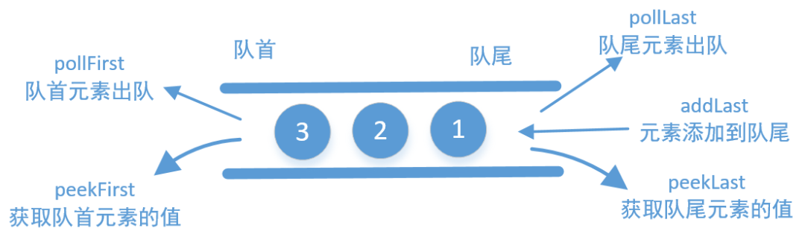

# 滑动窗口

滑动窗口算法可以用以解决数组/字符串的子元素问题，它可以将嵌套的循环问题，转换为单循环问题，降低时间复杂度。

**滑动窗口主要应用在数组和字符串上**。

滑动窗口算法更多的是一种思想，而非某种数据结构的使用。 

- **滑动：**说明这个窗口是移动的，也就是移动是按照一定方向来的。
- **窗口：**窗口大小并不是固定的，可以不断扩容直到满足一定的条件；也可以不断缩小，直到找到一个满足条件的最小窗口；当然也可以是固定大小。


算法思路：

1. 使用**双指针**中的左右指针技巧，初始化 left = right = 0，把索引闭区间 [left, right] 称为一个「窗口」。
2. 先不断地增加 right 指针扩大窗口 [left, right]，直到窗口符合要求
3. 停止增加 right，转而不断增加 left 指针缩小窗口 [left, right]，直到窗口中的字符串不再符合要求。同时，每次增加 left，我们都要更新一轮结果。
4. 重复第 2 和第 3 步，直到 right 到达尽头。

> 第 2 步相当于在寻找一个「可行解」，然后第 3 步在优化这个「可行解」，最终找到最优解。 左右指针轮流前进，窗口大小增增减减，窗口不断向右滑动。


算法的大致逻辑如下：

```c++
int left = 0, right = 0;

while (right < s.size()) {
    // 增大窗口
    window.add(s[right]);
    right++;

    while (window needs shrink) {
        // 缩小窗口
        window.remove(s[left]);
        left++;
    }
}
```


注意:

- 滑动窗口适用的题目一般具有单调性
- 滑动窗口、双指针、单调队列和单调栈经常配合使用

滑动窗口的思路很简单，但在leetcode上关于滑动窗口的题目一般都是mid甚至hard的题目。其难点在于，如何抽象窗口内元素的操作，验证窗口是否符合要求的过程。即上面步骤2，步骤3的两个过程。


#### [3. 无重复字符的最长子串](https://leetcode-cn.com/problems/longest-substring-without-repeating-characters/)

给定一个字符串，请你找出其中不含有重复字符的 最长子串 的长度。


```java
class L0003LongestSubstringWithoutRepeatingCharacters {
    public int lengthOfLongestSubstring(String s) {
        int res = 0;
        // 窗口左右边界
        int left = 0;
        int right = 0;
        // 窗口内容，通过map判断是否重复
        Map<Character, Integer> windowMap = new HashMap<>();
        while (right < s.length()) {
            // 窗口右侧边界扩张
            char c = s.charAt(right);
            right++;
            windowMap.put(c, windowMap.getOrDefault(c, 0) + 1);
            // 出现重复字符，窗口左侧边界收缩
            while (windowMap.get(c) > 1) {
                char d = s.charAt(left);
                left++;
                windowMap.put(d, windowMap.get(d) - 1);
            }
            // 更新结果
            res = Math.max(res, right - left);
        }
        return res;
    }
}
```


#### [239. 滑动窗口最大值](https://leetcode-cn.com/problems/sliding-window-maximum/)

给定一个数组 nums，有一个大小为 k 的滑动窗口从数组的最左侧移动到数组的最右侧。你只可以看到在滑动窗口内的 k 个数字。滑动窗口每次只向右移动一位。返回滑动窗口中的最大值。

进阶：你能在线性时间复杂度内解决此题吗？

> **示例:**
>
> 输入: nums = [1,3,-1,-3,5,3,6,7], 和 k = 3
> 输出: [3,3,5,5,6,7] 
> 解释: 
>
>   滑动窗口的位置                最大值
> ---------------               -----
> [1  3  -1] -3  5  3  6  7       3
>  1 [3  -1  -3] 5  3  6  7       3
>  1  3 [-1  -3  5] 3  6  7       5
>  1  3  -1 [-3  5  3] 6  7       5
>  1  3  -1  -3 [5  3  6] 7       6
>  1  3  -1  -3  5 [3  6  7]      7


双端队列常用的几个函数：



```java
class L0239SlidingWindowMaximum {
    public int[] maxSlidingWindow(int[] nums, int k) {
        int left = 0;
        int right = 0;
        int[] res = new int[nums.length - k + 1];

        // 双端队列，保存当前窗口最大值，保证队列中数值按从大到小排序
        LinkedList<Integer> queue = new LinkedList<>();
        while (right < nums.length) {
            // 保证从大到小，如果前面数小则需要依次弹出，直至满足要求
            while (!queue.isEmpty() && nums[right] > queue.peekLast()) {
                queue.removeLast();
            }
            queue.add(nums[right]);
            right++;
            if (right < k) {
                continue;
            }
            // 当前窗口最大值
            res[left++] = queue.peekFirst();
            // 如果第一个值在窗口外面，移除
            if (queue.peekFirst() == nums[right - k]) {
                queue.removeFirst();
            }
        }
        return res;
    }
}
```


#### [480. 滑动窗口中位数](https://leetcode-cn.com/problems/sliding-window-median/)

中位数是有序序列最中间的那个数。如果序列的大小是偶数，则没有最中间的数；此时中位数是最中间的两个数的平均数。

给你一个数组 nums，有一个大小为 k 的窗口从最左端滑动到最右端。窗口中有 k 个数，每次窗口向右移动 1 位。你的任务是找出每次窗口移动后得到的新窗口中元素的中位数，并输出由它们组成的数组。

> **示例：**
>
> 给出 *nums* = `[1,3,-1,-3,5,3,6,7]`，以及 *k* = 3。
>
> 窗口位置                      中位数
>
> ---------------               -----
> [1  3  -1] -3  5  3  6  7       1
>  1 [3  -1  -3] 5  3  6  7      -1
>  1  3 [-1  -3  5] 3  6  7      -1
>  1  3  -1 [-3  5  3] 6  7       3
>  1  3  -1  -3 [5  3  6] 7       5
>  1  3  -1  -3  5 [3  6  7]      6
>
>  因此，返回该滑动窗口的中位数数组 `[1,-1,-1,3,5,6]`。


#### [76. 最小覆盖子串](https://leetcode-cn.com/problems/minimum-window-substring/)

给你一个字符串 s 、一个字符串 t 。返回 s 中涵盖 t 所有字符的最小子串。如果 s 中不存在涵盖 t 所有字符的子串，则返回空字符串 "" 。

注意：如果 s 中存在这样的子串，我们保证它是唯一的答案。


```java
class L0076MinimumWindowSubstring {
    public String minWindow(String s, String t) {
        // 统计t中各字符次数
        Map<Character, Integer> needsMap = new HashMap<>();
        for (int i = 0; i < t.length(); i++) {
            needsMap.put(t.charAt(i), needsMap.getOrDefault(t.charAt(i), 0) + 1);
        }

        String res = "";
        int left = 0;
        int right = 0;
        Map<Character, Integer> windowMap = new HashMap<>();

        // 记录目前有多少个字符
        int count = 0;
        // 记录最短需要多少个字符
        int minLength = s.length() + 1;
        while (right < s.length()) {
            char ch = s.charAt(right);
            windowMap.put(ch, windowMap.getOrDefault(ch, 0) + 1);
            // 新增一个满足条件的字符
            if (needsMap.getOrDefault(ch, 0) > 0 && needsMap.get(ch) >= windowMap.get(ch)) {
                count++;
            }
            // 找到全部字符，满足条件了，移动左边
            while (count == t.length()) {
                ch = s.charAt(left);
                // 移除最左边一个满足条件的字符（在t中）
                if (needsMap.getOrDefault(ch, 0) > 0 && needsMap.get(ch) >= windowMap.get(ch)) {
                    count--;
                }
                // 更新结果
                if (right - left + 1 < minLength) {
                    minLength = right - left + 1;
                    res = s.substring(left, right + 1);
                }
                windowMap.put(ch, windowMap.get(ch) - 1);
                left++;
            }
            right++;
        }
        return res;
    }
}
```


#### [438. 找到字符串中所有字母异位词](https://leetcode-cn.com/problems/find-all-anagrams-in-a-string/)

给定一个字符串 s 和一个非空字符串 p，找到 s 中所有是 p 的字母异位词的子串，返回这些子串的起始索引。

字符串只包含小写英文字母，并且字符串 s 和 p 的长度都不超过 20100。

说明：

- 字母异位词指字母相同，但排列不同的字符串。
- 不考虑答案输出的顺序。

> **示例:**
>
> 输入:
> s: "cbaebabacd" p: "abc"
>
> 输出:
> [0, 6]
>
> 解释:
> 起始索引等于 0 的子串是 "cba", 它是 "abc" 的字母异位词。
> 起始索引等于 6 的子串是 "bac", 它是 "abc" 的字母异位词。

```java
class L0438FindAllAnagramsInAString {
    public List<Integer> findAnagrams(String s, String p) {
        // p中各字符的次数
        int[] needs = new int[26];
        for (int i = 0; i < p.length(); i++) {
            needs[p.charAt(i) - 'a']++;
        }

        List<Integer> res = new LinkedList<>();
        int left = 0;
        int right = 0;
        int[] window = new int[26];
        while (right < s.length()) {
            // 向右新增一个位置
            int ch = s.charAt(right) - 'a';
            window[ch]++;
            right++;
            // 左边界右移动
            while (window[ch] > needs[ch]) {
                window[s.charAt(left) - 'a']--;
                left++;
            }
            // 长度和p一样满足条件，记录位置
            if (right - left == p.length()) {
                res.add(left);
            }
        }
        return res;
    }
}
```


#### [567. 字符串的排列](https://leetcode-cn.com/problems/permutation-in-string/)

给定两个字符串 **s1** 和 **s2**，写一个函数来判断 **s2** 是否包含 **s1** 的排列。

换句话说，第一个字符串的排列之一是第二个字符串的子串。
```java
class L0567PermutationInString {
    public boolean checkInclusion(String s1, String s2) {
        int[] needs = new int[26];
        // 不同字符数量
        int charUnique = 0;
        for (int i = 0; i < s1.length(); i++) {
            int cur = s1.charAt(i) - 'a';
            if (needs[cur] == 0) {
                charUnique++;
            }
            needs[cur]++;
        }

        int left = 0;
        int right = 0;
        int[] window = new int[26];
        // 记录已满足条件的字符数量
        int valid = 0;
        while (right < s2.length()) {
            int ch = s2.charAt(right) - 'a';
            right++;
            // 如果该字符需要
            if (needs[ch] > 0) {
                window[ch]++;
                // 该字符已经全部满足
                if (window[ch] == needs[ch]) {
                    valid++;
                }
            }

            // 窗口长度大于等于需要长度
            while (right - left >= s1.length()) {
                // 所有字符满足条件（字符个数相同），则返回true
                if (valid == charUnique) {
                    return true;
                }
                // 左边界移动
                int leftDel = s2.charAt(left) - 'a';
                left++;
                if (needs[leftDel] > 0) {
                    if (window[leftDel] == needs[leftDel]) {
                        valid--;
                    }
                    window[leftDel]--;
                }
            }
        }
        return false;
    }
}
```


## References
- [labuladong-我写了套框架，把滑动窗口算法变成了默写题](https://mp.weixin.qq.com/s?__biz=MzAxODQxMDM0Mw==&mid=2247485141&idx=1&sn=0e4583ad935e76e9a3f6793792e60734)
- [滑动窗口算法基本原理与实践](https://www.cnblogs.com/huansky/p/13488234.html)
- [【无重复字符的最长子串】滑动窗口，精简代码，图解模拟](https://leetcode-cn.com/problems/longest-substring-without-repeating-characters/solution/longest-substring-without-repeating-characters-b-2/)
- [239. 滑动窗口最大值（3种解决方式）](https://leetcode-cn.com/problems/sliding-window-maximum/solution/3chong-jie-jue-fang-shi-by-sdwwld/)
- [滑动窗口-最小覆盖子串](https://leetcode-cn.com/problems/minimum-window-substring/solution/hua-dong-chuang-kou-ji-bai-liao-100de-javayong-hu-/)